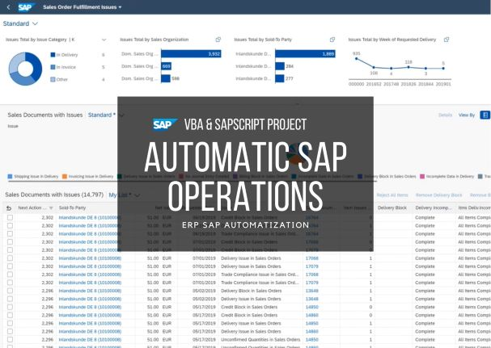

# VBA & SAP - Automatic SAP Operations

<!---Esses são exemplos. Veja https://shields.io para outras pessoas ou para personalizar este conjunto de escudos. Você pode querer incluir dependências, status do projeto e informações de licença aqui--->

## 🚀 Introduction

> The VBA-SAP-Scripting repository contains programming codes in the VBA language and integrating with SAP ERP for the most diverse system transactions. Transactions are intended for operations in the supply sector in a multinational company.

## 🚀 Objectives

> Macros were developed for the most diverse operations to automate the process and facilitate the workflow, in some cases leading to a reduction in operating times by more than 90%. This repository was created with the objective of safeguarding the acquired knowledge, as well as creating a professional portfolio.
